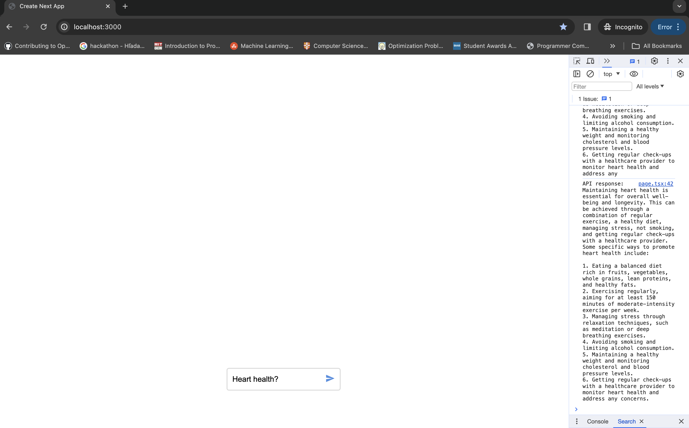

# MediSearch frontend take-home test part 1

## Description

Thanks for your interest in working at MediSearch. In this frontend coding test, you will implement a simple chat page that will allow users to interact with a large language model (LLM)

## Specification

### Starting point

As a starting point, we have created the NextJS application you can find in this repo. As a first step, please run `npm install && npm run dev` and let us know if you run into issues viewing the app on localhost. The main parts of the application are:

1. `src/page.tsx`: The chat page that you will be implementing. The page already contains a chat box and some basic state for handling messages between the LLM and the interface. We recommend that you get familiar with the state varialbes on this page, as these will help you to quickly complete our tasks. If you try to make a query, you should see the LLM response being logged in the console as so:

2. `src/components/*`: Where you should store re-usable components during the development of the app. You can see that we have already created a `ChatInputField` component used on the chat page.
3. `src/api/chat/route.tsx`: API route for making queries to OpenAI's LLM. You do not need to touch this code.

### Tasks

1. **ChatInputField fixes**: `ChatInputField` is currently not responsive. Adjust the code such that the component looks nice on all screen sizes. Further, make sure we can also make a query by hitting enter instead of just by clicking the _message icon_.
2. **Responsive Chat UI**: Using our `messages` state variable, design and implement a responsive chat UI. Ensure that messages are clearly distinguishable between the user and the LLM. Make sure to show appropriate loading indicators while the LLM is processing the user's query.
3. **Code cleanup**: Make sure the code is well-organized and future proof. Make sure you can run the code with `npm run build && npm run start`.

## Submission instructions

Email `founders@medisearch.io` the zipped codebase containing your code. Also please honestly report the time that this test has taken you. However, please note that speed isn't very important.
